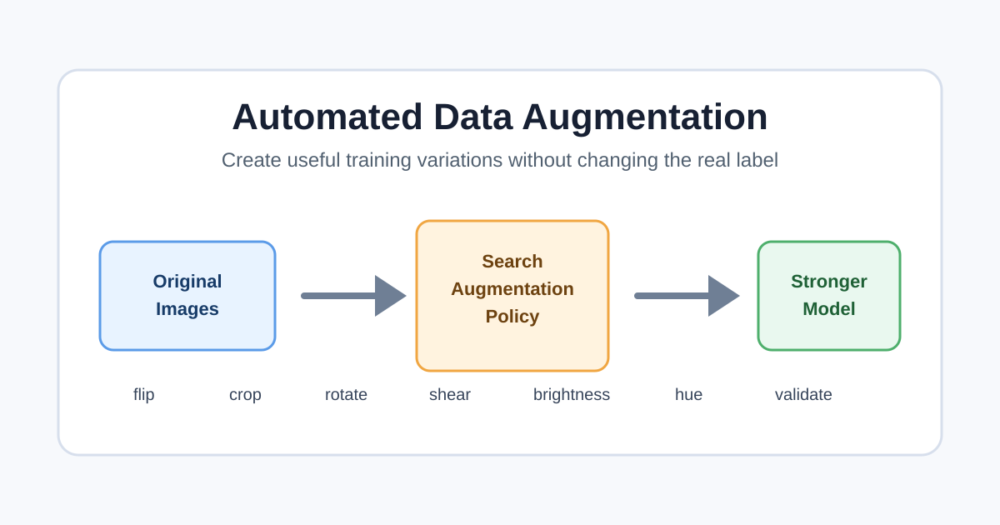

# Automated Data Augmentation: A Beginner-Friendly Guide

Machine learning models learn from examples. If a model only sees a small number of examples, it can memorize the training data instead of learning patterns that work on new data. Data augmentation helps solve this problem by creating realistic variations of existing training examples.

For image projects, augmentation can create new versions of an image by flipping it, cropping it, rotating it, shearing it, changing brightness, or changing color. The label stays the same because the main object is still the same. For example, a horizontally flipped dog image is still a dog.

Automated data augmentation means we do not choose every transformation manually. Instead, we define a search space of possible transformations and let an algorithm, validation loop, or learned policy decide which combinations improve the model.

## 1. Start With the Problem

Before augmenting data, define the task clearly. Ask:

- What is the model predicting?
- Which changes should not affect the label?
- Which changes would make the example unrealistic?

For a dog breed classifier, small rotations, crops, and brightness changes are usually reasonable. Turning the image upside down may be less realistic. For medical images, even small transformations may need expert review because orientation and shape can carry important meaning.

## 2. Choose Safe Transformations

A safe transformation keeps the label true. Common image transformations include:

- Horizontal flip: mirrors the image from left to right.
- Random crop: selects a smaller part of the image.
- Rotation: turns the image by a chosen angle.
- Shear: slants the image shape.
- Brightness adjustment: makes the image lighter or darker.
- Hue adjustment: shifts the color tone.

In TensorFlow, these can be written with image utilities such as:

```python
flipped = tf.image.flip_left_right(image)
cropped = tf.image.random_crop(image, (200, 200, 3))
rotated = tf.image.rot90(image)
brighter_or_darker = tf.image.random_brightness(image, 0.3)
hue_changed = tf.image.adjust_hue(image, -0.5)
```

## 3. Build an Augmentation Pipeline

An augmentation pipeline applies transformations while the model is training. This is useful because the model can see a slightly different version of the same image each epoch.

A simple process looks like this:

1. Load the original training image.
2. Randomly choose one or more transformations.
3. Apply the transformations.
4. Send the augmented image to the model.
5. Keep the original label unchanged.

The validation and test sets should usually not be augmented. They should represent real examples so that evaluation remains honest.

## 4. Automate the Search

Manual augmentation depends on human guesses. Automated augmentation improves this by searching for good policies. A policy is a set of transformations, probabilities, and strengths.

For example:

- Flip with probability 0.5.
- Crop to 80 percent of the original image.
- Change brightness by up to 0.3.
- Rotate by 90 degrees only for classes where orientation does not matter.

Automation can test many policies and compare validation performance. If a policy improves validation accuracy or reduces overfitting, it is a good candidate. If performance gets worse, the policy may be too aggressive or unrealistic.

## 5. Train and Validate Carefully

After choosing an augmentation policy, train the model on augmented training data and evaluate it on unchanged validation data. Watch for these signs:

- Training accuracy is high but validation accuracy is low: the model may still be overfitting.
- Training accuracy is lower but validation accuracy improves: augmentation may be helping generalization.
- Both training and validation accuracy decrease: augmentation may be too strong.

The goal is not to make images look dramatically different. The goal is to help the model learn stable patterns.

## 6. Keep the Pipeline Reproducible

Good machine learning work should be repeatable. Save the settings used for augmentation, including transformation names, probability values, intensity values, and random seeds when possible.

Documenting the pipeline helps another person understand how the final model was trained. It also makes debugging easier if the model behaves unexpectedly.

## 7. Example Workflow

Imagine a small image classification project with 1,000 dog images. A beginner-friendly automated workflow could be:

1. Train a baseline model with no augmentation.
2. Add simple random flips and brightness changes.
3. Compare validation accuracy to the baseline.
4. Add crops, rotations, and shearing one at a time.
5. Keep transformations that improve validation results.
6. Remove transformations that make images unrealistic or reduce performance.
7. Train the final model using the best policy.
8. Test the final model once on the untouched test set.

This approach is simple, but it is already a form of automation because the policy is selected through measured validation results instead of guesswork alone.

## Conclusion

Data augmentation creates more training variety from existing data. Automated data augmentation goes further by testing and selecting useful transformations. When done carefully, it can reduce overfitting, improve generalization, and make models stronger without collecting thousands of new examples.

The most important rule is simple: augmented examples must still be realistic, and their labels must still be correct.
