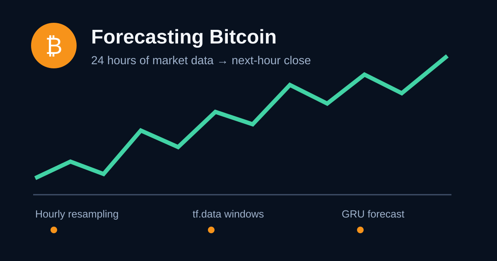

# Forecasting Bitcoin One Hour Ahead with a GRU

Bitcoin invites a tempting question: can its next move be predicted from its
recent history? In this project I used the previous 24 hourly observations from
Coinbase and Bitstamp to estimate the closing BTC/USD price one hour later.
This is a learning exercise, not a trading recommendation.

## What time-series forecasting means

A time series is a sequence whose order matters. Shuffling hourly BTC prices
would destroy the relationship between one hour and the next. Forecasting uses
the information available up to time *t* to estimate a value after *t*. My
supervised-learning example is:

```text
[hour t-23, ..., hour t] -> closing price at hour t+1
```

A **stationary** series has statistical properties such as its mean and
variance that stay approximately constant over time. Raw BTC price is not
stationary: its level and volatility can change dramatically. Standardization
helps optimization, but does not magically make the market stationary. Returns
or price differences would be a useful experiment for a more stationary
target.

**Seasonality** is a pattern tied to a fixed calendar interval; **cyclicity**
is a recurring rise and fall without a fixed period. Crypto trades continuously,
but activity can still vary by hour or weekday. I represented those calendar
positions as sine/cosine pairs so that Sunday and Monday, or 23:00 and 00:00,
remain close numerically. Market cycles are less regular and much harder to
learn reliably.

## From raw minutes to useful hours

The raw files contain one row per minute: Unix time, OHLC prices, BTC volume,
currency volume, and volume-weighted average price (VWAP). A 24-hour sequence
of minute data would require 1,440 recurrent steps and much more computation.
Because the target is one hour ahead, I changed the sampling window from 60
seconds to one hour.

For every hour I kept the first open, maximum high, minimum low, and last close.
I summed both volume columns and recomputed VWAP using BTC volume. I combined
the exchanges to reduce dependence on quirks from one venue. Empty price gaps
of at most three hours are time-interpolated; volume for empty hours becomes
zero. Longer gaps are removed rather than inventing a long stretch of prices.
I then keep the longest uninterrupted hourly segment so no model window silently
jumps across missing time.

I did not feed raw Unix timestamps to the network. They mostly encode an
ever-increasing number, while the useful calendar information is captured by
hour and weekday cycles. The data is split chronologically into 70% training,
15% validation, and 15% testing. I calculate every normalization statistic on
the training portion only, preventing future information from leaking into
training.

## Building the `tf.data.Dataset`

Keras's `timeseries_dataset_from_array` returns a `tf.data.Dataset`. Each item
contains a tensor shaped `(24, number_of_features)` and one scaled closing-price
label. I preserve chronological order for validation and testing; only training
windows are shuffled. Batching 64 windows reduces update overhead, and
prefetching with `tf.data.AUTOTUNE` overlaps input preparation with model work.

The key setup is:

```python
dataset = tf.keras.utils.timeseries_dataset_from_array(
    data=data[:-1],
    targets=data[24:, close_index],
    sequence_length=24,
    batch_size=64,
)
dataset = dataset.prefetch(tf.data.AUTOTUNE)
```

The validation and test slices include the preceding 24 context hours, but
their targets begin inside their own partitions. This preserves useful context
without evaluating on training labels.

## Why I chose a GRU

My model has a 64-unit GRU that returns a sequence, 20% dropout, a 32-unit GRU,
a 16-unit ReLU dense layer, and one linear output. Gated recurrent units can
retain and forget information across the 24 steps, but have fewer gates and
parameters than LSTMs. That makes a GRU a practical middle ground for this
relatively short sequence. The linear output is appropriate for an unrestricted
continuous value.

I trained with Adam and mean-squared error (MSE), as required. MSE penalizes
large misses strongly. I also report MAE and RMSE in dollars, which are easier
to interpret. Early stopping restores the weights from the best validation
epoch, and a checkpoint saves that model.

## Results

> Publication note: run the two commands in the repository, then replace the
> values below from `btc_forecast_results/metrics.json` and insert the generated
> `training_history.png` and `test_forecast.png`. Do not publish invented data.

- Test MSE: **[RUN REQUIRED] USD²**
- Test RMSE: **[RUN REQUIRED] USD**
- Test MAE: **[RUN REQUIRED] USD**
- Epochs trained: **[RUN REQUIRED]**


The most important comparison is a naive persistence baseline that predicts
the next close will equal the latest close. BTC prices are autocorrelated at
short horizons, so a graph that looks close is not enough; the trained model
must beat that baseline on unseen data to demonstrate useful signal.

## Conclusion

This project made the discipline of time-series work concrete for me. Ordering,
aggregation, leakage-free scaling, and honest chronological validation matter
at least as much as choosing a recurrent layer. A GRU can learn patterns in
historical candles, but BTC also reacts to news, liquidity, regulation, and
crowd behavior that these inputs do not contain. I would treat the forecast as
an experiment, never as a stand-alone reason to invest.

The complete preprocessing and training code is available in my
[GitHub repository](https://github.com/Samkwizera/alu-machine_learning/tree/main/supervised_learning/time_series).
